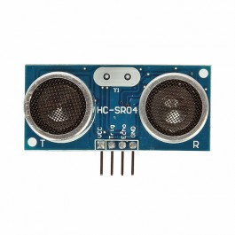

# Array of Ultrasonics Controlling Pumps

This is a project that utilizes the mojo FPGA board to talk to
multiple Ultrasonic Sensors (HCSR04). It then uses an arduino to talk
to it over UART. The arduino can then send signals to 9 different
pumps, if it has issues doing that, then we could utilize the mojo to
break it out even further.

## [HCSR04](res/HCSR04_micropik.pdf)

### Specifications:

* Range: 2cm - 400cm
* Response Width: 150uS - 25mS, 38mS if nothing
* Resolution: 0.3cm, so 400 / 0.3 = 1333.3, so need atleast 11 bits. 
	* So min time resoultion should be 17.65 uS, to reach 0.3cm.
	* If use 16bit range, max resolution should be 0.5798 uS, to
	atleast reach 38mS. 
* Power Supply: 5V
* Current: 
	* Quiescent: < 2mA
	* Working: 15mA
* Angle: < 15&deg; on one side, total is 30&deg; 
* Frequency of Signal: 40kHz
* Trigger Input: 10uS
* Recommended measurement cycle: > 60mS

### Operation

To start measurement, set trigger high for atleast 10uS. Then on
positive edge of echo time the duration that echo is high. The
corresponding distance should be T * 340m/s / 2 meters, since 340m/s
is the speed of sound. Which is about T/57, if you're looking from
conversion from uS to cm.

### Verilog Module

This is a pretty straightforward module. It has states:

* Reset
* Idle (possible if want to trigger it)
* Trigger (output high for 10uS)
* Count (for echo)
	* Start counting initially
	* Start counting again when positive edge
	* Stop on falling edge 
		* On stop, update time and go to idle / cool down
	* Stop if reached max wait
		* don't update time
* Cool Down (wait for total to get to reccomended 60mS, this would
  mean only 16 measurements / s, so wait to see)

#### I/O

Inputs:

* reset
* clk (probably lower than sys clock, because want to count slower,
  don't break up into separate clock or else could miss reset state
  initialization)
* measure (leave Idle and get measurement, default 1)
* __echo__ (HCSR04 pin to measure distance)

Outputs:

* [15:0] ticks (number of time\_clk ticks in echo signal, for distance)
* valid (whether or not the current reading is valid)
* __trigger__ (HCSR04 pin to start measurement)

Parameters:

* TRIGGER\_DURATION (how many ticks to keep trigger on)
* MAX\_COUNT (how many ticks to wait before setting invalid)

